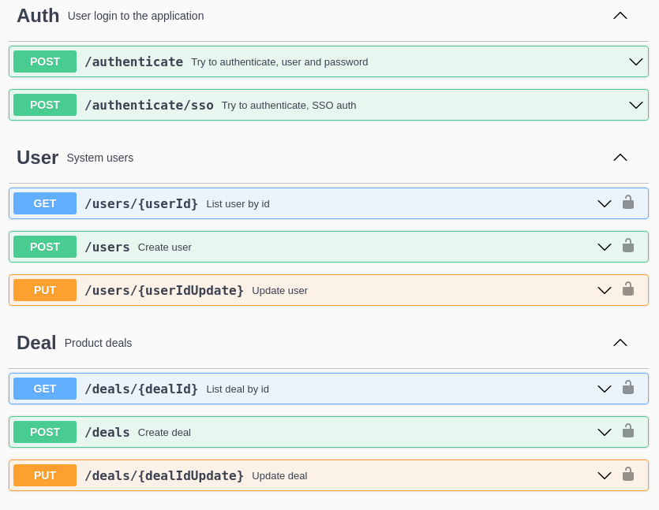
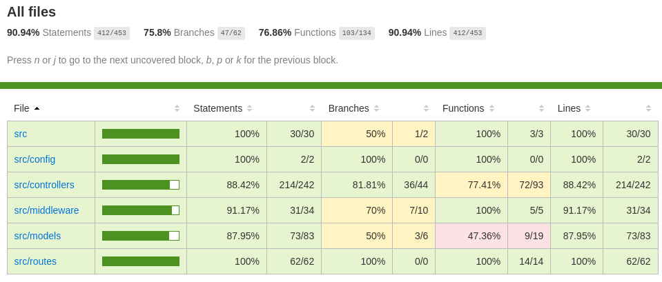

# Ecommerce Venda e Troca

Site ecommerce para venda e troca de produtos de tecnologia de forma rápida, otimizando seus custos com estruturas de trabalho.

## Summary

- [Ecommerce Venda e Troca](#ecommerce-venda-e-troca)
  - [Summary](#summary)
  - [Estimativa de desenvolvimento](#estimativa-de-desenvolvimento)
  - [Stack](#stack)
  - [Install](#install)
    - [Pre-requisites](#pre-requisites)
    - [Starting the appication](#starting-the-appication)
    - [Logs](#logs)
    - [Environments](#environments)
  - [Tests](#tests)

## Estimativa de desenvolvimento

Estimativa em horas de desenvolvimento (disponibilidade de 20h/semana):

| Atividade                         | Estimativa       | Tarefa |
| --------------------------------- | ---------------- | ------ |
| Análise de escopo do sistema      | 02:00h           | #1     |
| Definição de stack e configuração | 01:00h           | #2     |
| Autenticação                      | 02:00h           | #3     |
| Gestão de Usuário                 | 02:00h           | #5     |
| Gestão de Negociação              | 02:00h           | #6     |
| Gestão de Oferta em negociação    | 02:00h           | #7     |
| Gestão de Mensagens               | 02:00h           | #8     |
| Gestão de Frete                   | 03:00h           | #9     |
| Convite                           | 02:00h           | #10    |
| ---                               | ---              | ---    |
| **Total de horas**                | **18:00h**       |
| **Estimativa de entrega**         | **4 dias úteis** |

## Stack

- PostgreSQL version 13.4
- Node version 16
  - Web application framework: express
  - ORM: sequelize
  - Tests: nyc, mocha
  - API docs: swagger

## Install

### Pre-requisites

- docker
- docker-compose

### Starting the appication

Go to the project root directory.

Install node dependencies:

```bash
docker run --rm -v ${PWD}:/app -w=/app node:16 npm install
```

Start the stack:

```bash
docker-compose up -d --build
```

The services will be avaliable on:

- Database

  - Host: `localhost`
  - Port: `5440`
  - Database: `ecommerce`
  - User: `ecommerce-user`
  - Password: `RAnoP5244X9Aen5w8U6CKQ`
  - Database data: `~/postgres/ecommerce`

- Web server

  - URL: [localhost:9090](http://localhost:9090/)
  - user: `evertonpaiva`
  - password: `abc123-`
  - app_token: `f0e21030-1edc-013a-e198-0aa5d4c8e409199476`

- API Documentation
  - URL: [localhost:9090/api-docs](http://localhost:9090/api-docs)

_Swagger API Documentation example:_



### Logs

Access the web server logs:

```bash
docker logs -f ecommerce-web
```

### Environments

Variables description:

- NODE_HOST: host address of the server
- NODE_PORT: host port of the server
- API_USER: initial user
- API_PASS: initial password
- API_VERSION: current api version
- API_APP_TOKEN: initial app token
- DATABASE_FORCE_DROP: force drop and recreate to database objects
- DATABASE_POPULATE_DATA: insert initial data to database
- DATABASE_SHOWLOGS: show sql logs to webserver log output

Environment variable files:

- Development: `.env`
- Test: `.env.test`

## Tests

Runnings tests instructions:

```bash
# log in to webserver container
docker exec -it ecommerce-web bash

# running tests
npm run test

# running tests with code coverage report
npm run test:coverage

# exiting the container
exit
```

_Running tests example:_


The **code coverage report** will be avaliable ate do `coverage` directory, root dir at this project. Open `index.html` with a browser to visualize.

_Code coverage report example:_


